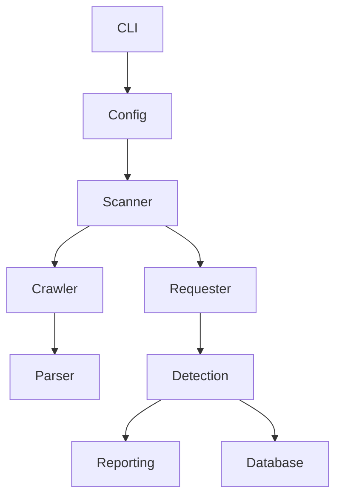

# SSRFHunter Pro

SSRFHunter Pro is an enterprise-grade SSRF security assessment framework designed for authorized security testing, penetration testing with permission, security research, and education.


## Features

- Asynchronous scanning engine with worker pools, timeouts, and retries
- Intelligent crawler for HTML links, forms, JSON APIs, OpenAPI/Swagger, robots.txt, and sitemap discovery
- URL parameter enumeration and form submission discovery
- Configurable YAML-driven payload library for localhost, metadata, internal network, and protocol-specific checks
- Response analysis with severity scoring and evidence extraction
- Rich HTML, JSON, and Markdown reporting
- SQLite-backed scan history and persistence
- Docker-ready deployment and GitHub Actions CI

## Architecture



## Installation

```bash
python -m venv .venv
.\.venv\Scripts\Activate.ps1
pip install --upgrade pip
pip install -r requirements.txt
pip install -e .
```

## Quick Start

```bash
ssrfhunter scan --url https://example.test --workers 8 --timeout 10 --html --json
```

## CLI Examples

```bash
ssrfhunter crawl --url https://example.test --max-depth 3
ssrfhunter scan --url https://example.test --workers 6 --timeout 15 --output reports --html
ssrfhunter history --limit 5
ssrfhunter report --scan-id 1 --html
```

## Configuration

The framework supports optional YAML configuration via `config.yml` in the repository root. CLI flags always override configuration file values.

## Examples

- `examples/config.yml` — sample runtime configuration.
- `examples/targets.txt` — sample multi-target scan list.

## Development

```bash
pytest
ruff check .
black .
mypy ssrfhunter
```

## Docker

```bash
docker compose up --build
```

## Contributing

See `CONTRIBUTING.md` for contribution and code review guidance.

## License

MIT
